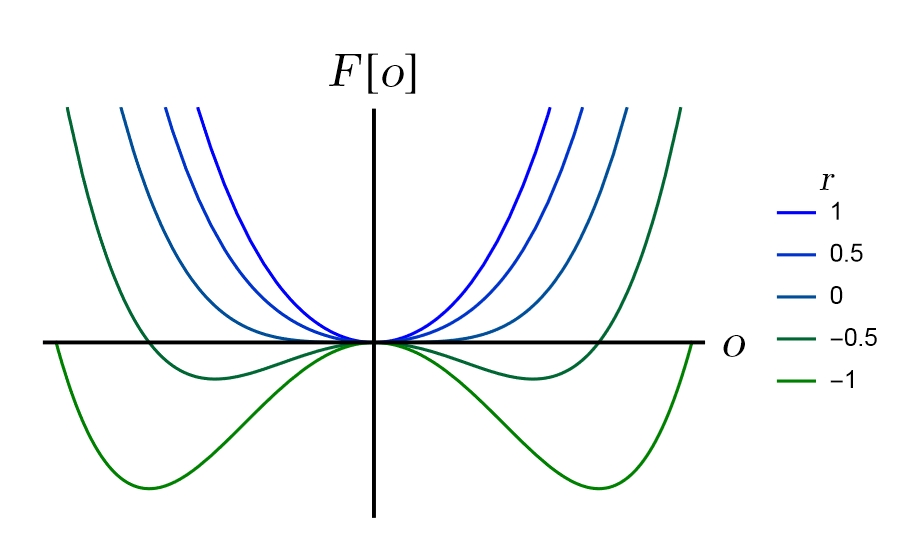
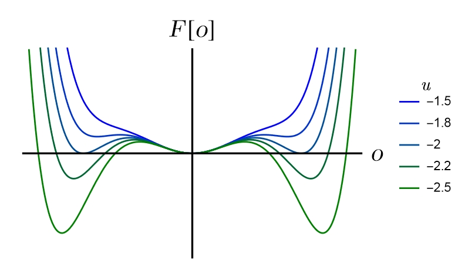
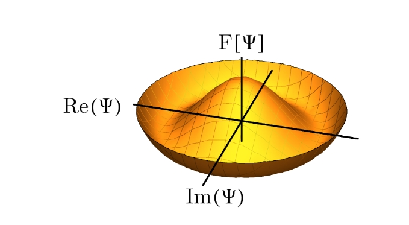
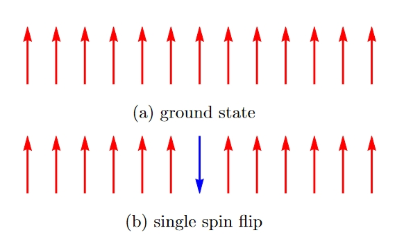

## 相变中的对称性破缺以及拓扑缺陷

---

#### Classification
序参量

  * $\left<o\right>=0$,无序状态，高对称性
  * $\left<o\right>\neq0$,有序状态，对称性破缺

---

#### Classification
相变

* 1st, o 不连续
* higher  st，o 连续 $\mathrm{d}^{n-1}o$不连续

经验上：对称性不变的一般是1st（$l\rightarrow s$例外）

---
#### critical point 

2st ：关联长度发散
scale-invariant： 和体系大小无关

经典例子：临界乳光

---

#### Landau theory

想法：free energy
展开

$$
\begin{equation}
\mathcal{F}_{\mathrm{L}}[o, T]=\mathcal{F}[0, T]+\frac{1}{2} r(T) o^2+\frac{1}{4} u(T) o^4+\ldots
\end{equation}
$$

---

#### 四阶实参量

---

#### critical exponent 
$$
\begin{equation}
r(T) \approx r_0 \frac{T-T_{\mathrm{c}}}{T_{\mathrm{c}}} \equiv r_0 t
\end{equation}
$$
$$
\begin{equation}
o(T) \propto\left(T-T_{\mathrm{c}}\right)^{\frac{1}{2}}
\end{equation}
$$

如果想找到1st...

---
#### 六阶实参量

---
#### symmetry breaking in L Theory

* $\mathbb{Z}_2$
* $\mathbb{U}(1)$
$$
\begin{equation}
\mathcal{F}_{\mathrm{L}}[\psi, T]=\mathcal{F}[0, T]+\frac{1}{2} r(T) \psi^* \psi+\frac{1}{4} u(T)\left(\psi^* \psi\right)^2
\end{equation}
$$

---
 

---
#### phase gauge $\Rightarrow \mathbb{U}(1)$

NGmode

---
#### Universality

相同的ssb带来相同的临界行为

* Ising & $l\rightarrow s$
* XYmodel & He4

与体系大小无关 scale-invariant

* 临界乳光
* 关联函数universal支持了重整化群...

---
#### 不合理性

Example：
$$
\begin{equation}
\mathcal{H} = J \sum_{i,\delta} \mathbf{S_i}\cdot \mathbf{S_{i+\delta}}
\end{equation}
$$
mean feild:
$$
\begin{equation}
m = \left< (-1)^i \mathbf{S_i} \right>
\end{equation}
$$
算下去最低阶就是四阶实参数

---
### topological defect

* 绕数（wind number）
* 缺陷的维度不同
  
|  D-1  | D-2  | D-3|
|  ----  | ----  |--- |
| domain wall | votrix | monopoles|

---

#### 产生

* 不容易产生也不容易消失
* 单个缺陷需要更多H
* 成对、量子计算？...

---
#### 1D Ising Model

---
#### 计算

###### 按照Landau计算

全上全下两种minimal

$\mathbb{Z}_2$ 对称性自发破缺

###### 实际上由于拓扑缺陷的自由能：

$$
\begin{equation}
F_{\text {domain wall }}=2 J-k_{\mathrm{B}} T \ln N
\end{equation}
$$

足够大体系，domain wall 熵带来绝对小的自由能

---
#### 外延和应用

* 同调群...
* Duality mapping 对偶映射 defect准粒子

$$
\sinh 2𝐾\cdot \sinh 2 𝐾^\prime = 1 
$$

---

#### 两点不合理

* 超标度律不一定满足
* 忽略了局部体系的相的变化

---
### 补充
改进：Ginzburg-Landau

$$
\begin{equation}
\mathcal{F}_{\mathrm{GL}}[o(\mathbf{x}), T]=\mathcal{F}[0, T]+\int \mathrm{d}^D x\left\{\frac{c^2}{2}[\nabla o(\mathbf{x})]^2+\frac{r(T)}{2}[o(\mathbf{x})]^2+\frac{u(T)}{4}[o(\mathbf{x})]^4+\ldots\right\}
\end{equation}
$$

---

### 参考资料

[1]Aron J. Beekman, Louk Rademaker, Jasper van Wezel,***Lect. Notes 11***,SciPost Phys.(2019) 
[2]L.D. Landau, E.M. Lifshitz,***Statistical Physics***, Part 1(1980)
[3]M. Nakahara. ***Geometry, topology and physics*** (2003)
[4]H. A. Kramers and G. H. Wannier, ***Statistics of the two-dimensional ferromagnet. part i***, Phys. Rev., vol. 60, pp. 252–262,Aug 1941
[5]Franz J. Wegner, ***Duality in Generalized Ising Models and Phase Transitions without Local Order Parameters.*** J. Math. Phys.(1971)

---